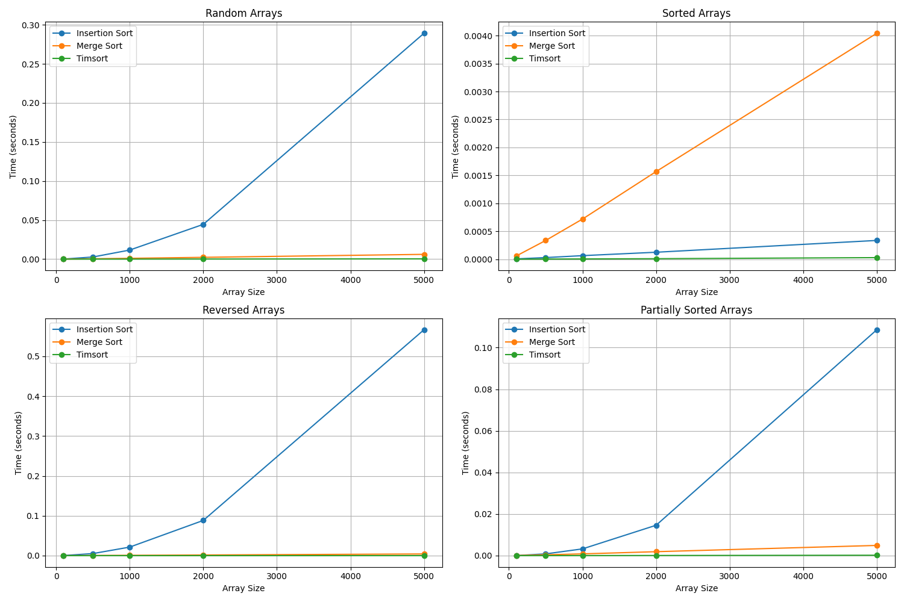

# goit-algo-hw-04

# Sorting Algorithms Comparison: Merge Sort, Insertion Sort, and Timsort

This project compares the performance of three sorting algorithms:

1. **Insertion Sort**: A simple comparison-based algorithm that builds the sorted array one item at a time
2. **Merge Sort**: A divide-and-conquer algorithm that splits the array, sorts the parts, and then merges them
3. **Timsort**: Python's built-in hybrid sorting algorithm that combines merge sort and insertion sort

## Algorithm Complexity

| Algorithm      | Best Case  | Average Case | Worst Case | Space Complexity |
| -------------- | ---------- | ------------ | ---------- | ---------------- |
| Insertion Sort | O(n)       | O(n²)        | O(n²)      | O(1)             |
| Merge Sort     | O(n log n) | O(n log n)   | O(n log n) | O(n)             |
| Timsort        | O(n)       | O(n log n)   | O(n log n) | O(n)             |

## Empirical Results

We tested these algorithms on four different types of data:

- Random arrays
- Already sorted arrays (best case)
- Reversed arrays (worst case)
- Partially sorted arrays

The results are visualized in the chart below:

### Key Findings

1. **Insertion Sort**:

   - Performs well on small arrays and already sorted arrays
   - Significantly degrades in performance as array size increases
   - Shows O(n²) behavior on random and reversed arrays

2. **Merge Sort**:

   - Maintains consistent O(n log n) performance across all data types
   - Much faster than Insertion Sort for large arrays
   - Requires additional memory for the merging process

3. **Timsort**:
   - Performs exceptionally well on all types of data
   - Adapts to patterns in the data, making it fastest for partially sorted arrays
   - Outperforms both custom implementations, demonstrating why it's Python's default

## Why Timsort is More Efficient

Timsort's superior performance can be attributed to its hybrid nature which combines the strengths of both insertion sort and merge sort:

1. **Adaptive Strategy**: Timsort identifies "runs" (sequences that are already ordered) and preserves them, reducing unnecessary comparisons.

2. **Small Array Optimization**: Uses insertion sort for small subarrays (typically less than 64 elements), where insertion sort is more efficient due to lower overhead.

3. **Memory Efficiency**: Minimizes temporary storage needs through intelligent merging strategies.

4. **Galloping Mode**: Employs a binary-search-like technique when merging runs, which reduces the number of comparisons needed.

5. **Stability**: Maintains the relative order of equal elements, which is important for many applications.

## Conclusions

1. **For Small Arrays**: Insertion sort can be competitive or even faster due to its simplicity and low overhead.

2. **For Large Arrays**: Merge sort provides reliable performance but Timsort consistently outperforms it.

3. **For Real-world Data**: Timsort's adaptive approach makes it exceptionally efficient for real-world data that often contains patterns or partially ordered sequences.

4. **Built-in vs Custom**: Python's built-in implementation is highly optimized and offers better performance than typical custom implementations of these algorithms.

5. **Practical Recommendation**: Unless you have a very specific use case that requires a custom implementation, prefer Python's built-in sorting functions (`sorted()` or `list.sort()`) as they leverage the highly optimized Timsort algorithm.

This empirical analysis confirms the theoretical complexity estimates and demonstrates why Timsort has become the standard sorting algorithm in Python, Java, and other modern programming languages.
